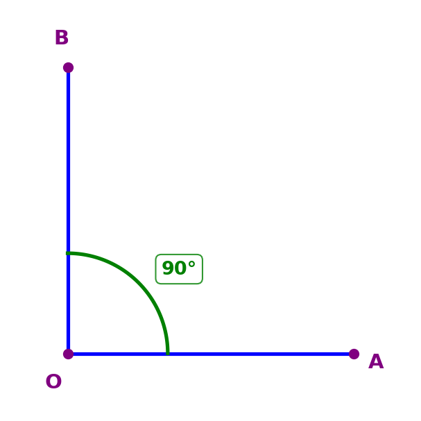
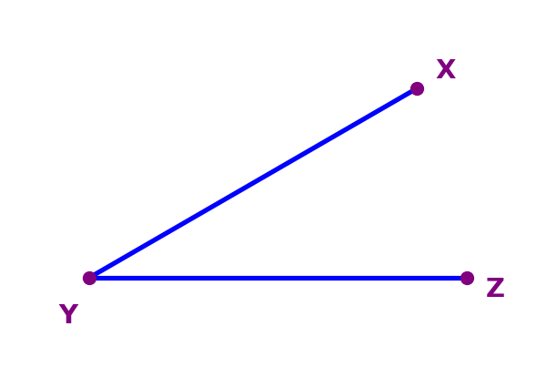
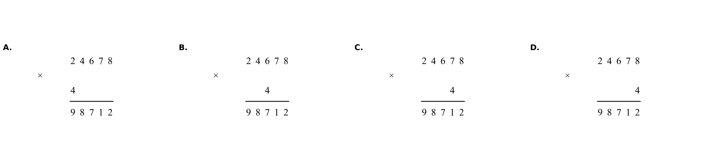
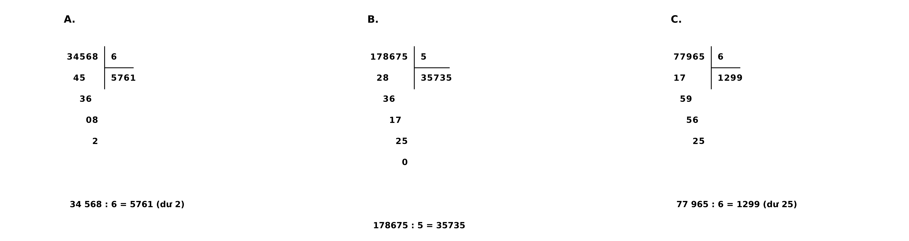

# Math Question Image Generator

## Mô tả

### **main1.py**  
Tạo hình ảnh các góc.
- Input mẫu
```
    DE_BAI = """
    Số đo của góc đỉnh O, cạnh OA, OB là: 
    A. 120°
    B. 130°
    C. 145°
    D. 150°
    """
    
    MO_TA = """
    Vẽ góc AOB, 
    Tia OA, OB màu xanh dương
    Chữ A, O, B màu tím
    Độ lớn góc: 90°
    Có vẽ cung tròn biểu diễn độ lớn góc

    Vẽ góc XYZ, 
    Tia ZY, XZ màu xanh dương
    Chữ X, Y, Z màu tím
    Độ lớn góc: 30
    Không vẽ cung tròn biểu diễn độ lớn góc
    """
```
- Output:
<p align="center">
  
  
</p>

---

### **main2.py**  
Tạo hình ảnh dạng bài điền vào dãy số trống (Dãy số với mỗi số hình tròn, số cần điền trong hình tròn rỗng).
- Input mẫu
```
    TYPE_EXERCISE = "Hoàn thành dãy số"
    UNIT = "Các số 0, 1, 2, 3, 4, 5"
    DETAIL ="""
    Điền số thích hợp vào chỗ trống
    Đáp án : Các số cần điền theo thứ tự từ trái qua phải là: 3, 2, 4, 1, 5

    Tạo 2 hình ảnh 1 hình tròn có số 1 ở chính giữa 
    Tạo 2 hình ảnh 1 hình tròn có số 2 ở chính giữa
    Tạo 2 hình ảnh 1 hình tròn có số 3 ở chính giữa
    Tạo 2 hình ảnh 1 hình tròn có số 4 ở chính giữa
    Tạo 2 hình ảnh 1 hình tròn có số 5 ở chính giữa
    Tạo 5 hình ảnh 1 hình tròn không in số
    Thứ tư xuất hiện của các hình tròn tính từ trái sang phải:
    - Hình tròn có số 1 ở chính giữa : [0, 5]
    - Hình tròn có số 2 ở chính giữa : [1, 11]
    - Hình tròn có số 3 ở chính giữa : [7, 12]
    - Hình tròn có số 4 ở chính giữa : [3, 13]
    - Hình tròn có số 5 ở chính giữa : [4, 9]
    - Hình tròn không có số ở chính giữa : [2, 6, 8, 10, 14]
    """
```
- Output:
<p align="center">
  
</p>

---

### **main3.py**  
Tạo hình ảnh bài toán cộng, trừ, nhân đặt tính rồi tính (Có hỗ trợ tạo sai vị trí cho số thứ 2).
 - Input mẫu
```
    TYPE_EXERCISE = "Tính"
    QUESTION = "Chọn phép đặt tính rồi tính đúng? (10đ). Đáp án: D"
    DETAIL ="""   
    Hình ảnh phép tính:
    Hình A: Viết số hạng thứ 1 là 24 678 ở hàng trên, số hạng thứ 2 là 4 viết hàng dưới thẳng hàng với số 2 ở hàng chục nghìn của số hạng thứ 1. Dấu x ở giữa. Dấu kẻ ngang dưới số hạng thứ 2. Kết quả là 98 712.
    Hình B: Viết số hạng thứ 1 là 24 678 ở hàng trên, số hạng thứ 2 là 4 viết hàng dưới thẳng hàng với số 6 ở hàng trăm của số hạng thứ 1. Dấu x ở giữa. Dấu kẻ ngang dưới số 4. Kết quả là 98 712.
    Hình C: Viết số hạng thứ 1 là 24 678 ở hàng trên, số hạng thứ 2 là 4 viết hàng dưới thẳng hàng với số 7 ở hàng chục của số hạng thứ 1. Dấu x ở giữa. Dấu kẻ ngang dưới số 4. Kết quả là 98 712.
    Hình D: Viết số hạng thứ 1 là 24 678 ở hàng trên, số hạng thứ 2 là 4 viết hàng dưới thẳng hàng với số 8 ở hàng đơn của số hạng thứ 1. Dấu x ở giữa. Dấu kẻ ngang dưới số 4. Kết quả là 98 712.
    """
```
 - Output:
<p align="center">
  
</p>

### **main4.py**  
Tạo hình ảnh bài toán chia đặt tính rồi tính (Có hỗ trợ tạo phép chia có dư).
 - Input mẫu
```
    TYPE_EXERCISE = "Tính"
    QUESTION = "(10đ) Phép chia nào sai. Đáp án: C"
    DETAIL ="""   
    Hình ảnh A: Đặt tính phép chia số bị chia 34 568 và số chia là 6. Thương là 5 761
    Ta viết số bị chia 34 568 tiếp theo kẻ 1 đường kẻ dọc và 1 đường kẻ ngang chia ô số chia và ô thương. Viết 6 vào ô số chia; viết 5 761 vào ô thương
    Ô số bị chia: dòng 1: viết “34 568”, dòng 2 viết số 45 thẳng hàng với số 4 và số 5 ở số bị chia. dòng 3: số 36 thẳng hàng với chữ số 56 của số bị chia; dòng 4 số 08 thẳng hàng với chữ số 68 của số bị chia. dòng 5: số 2 thẳng hàng với chữ số 8 của số bị chia
    Dòng 6: 34 568 : 6 = 5 761 (dư 2)

    Hình ảnh B: Đặt tính phép chia số bị chia 178 675 và số chia là 5. Thương là 35 735
    Ta viết số bị chia 178 675 tiếp theo kẻ 1 đường kẻ dọc và 1 đường kẻ ngang chia ô số chia và ô thương. Viết 5 vào ô số chia; viết 35 735 vào ô thương.
    Ô số bị chia:

    Dòng 1: viết "178 675"
    Dòng 2: viết số 28 thẳng hàng với số 7 và số 8 ở số bị chia
    Dòng 3: số 36 thẳng hàng với chữ số 86 của số bị chia
    Dòng 4: số 17 thẳng hàng với chữ số 67 của số bị chia
    Dòng 5: số 25 thẳng hàng với chữ số 75 của số bị chia
    Dòng 6: số 0 thẳng hàng với chữ số 5 của số bị chia

    Dòng 7: 178 675 : 5 = 35 735

    Hình ảnh C: Đặt tính phép chia số bị chia 77 965 và số chia là 6. Thương là 1 299
    Ta viết số bị chia 77 965 tiếp theo kẻ 1 đường kẻ dọc và 1 đường kẻ ngang chia ô số chia và ô thương. Viết 6 vào ô số chia; viết 1 299 vào ô thương.
    Ô số bị chia:

    Dòng 1: viết "77 965"
    Dòng 2: viết số 17 thẳng hàng với số 7 và số 7 ở số bị chia
    Dòng 3: số 59 thẳng hàng với chữ số 79 của số bị chia
    Dòng 4: số 56 thẳng hàng với chữ số 96 của số bị chia
    Dòng 5: số 25 thẳng hàng với chữ số 65 của số bị chia

    Dòng 6: 77 965 : 6 = 1 299 (dư 25)
    """
```
 - Output:
<p align="center">
  
</p>

## Hướng dẫn sử dụng

Chạy từng file Python tương ứng với loại hình ảnh bạn muốn tạo.

---